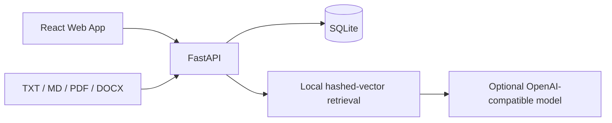

# Campus QA Design

## Architecture

The frontend is a Vite React SPA. FastAPI owns authentication, authorization,
document parsing, retrieval, answer generation, and persistence. SQLite keeps
the teaching setup portable. Embeddings use a deterministic hashed bag-of-words
vector, which can later be replaced by a remote embedding model or FAISS.

## Data Model

- `users`: identity, password hash, role, active state.
- `documents`: uploaded file metadata and processing state.
- `chunks`: extracted text and serialized vector per document.
- `conversations`: user-owned chat sessions.
- `messages`: questions, answers, and source snapshots.

## Security

- Passwords use PBKDF2-HMAC-SHA256 with per-user salts.
- Tokens are signed JWT-compatible HS256 values with expiration.
- Every protected route validates the current active user.
- Administration routes additionally require the `ADMIN` role.
- Uploads enforce extension and size limits and use generated storage names.

## UI Specification

- Purpose: a focused learning and knowledge-operations workspace for students
  and course administrators.
- Direction: industrial/utilitarian with editorial hierarchy.
- Palette: carbon `#17211D`, forest `#1F4D3A`, paper `#F5F3EC`, signal
  orange `#E76F3C`, steel `#68736D`.
- Typography: IBM Plex Sans SC, Noto Sans SC, fallback sans-serif.
- Layout: narrow left rail, asymmetric work canvas, compact data surfaces, and
  a mobile bottom navigation.

## Testing

- Backend API tests cover auth, role protection, document ingestion, retrieval,
  chat persistence, and history deletion.
- Frontend runs TypeScript, ESLint, and production build checks.
- Browser smoke testing covers login, chat, source display, document upload,
  history, and responsive navigation.

